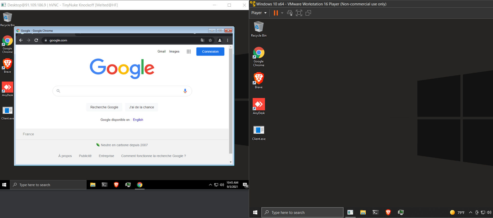

# HVNC

Standalone HVNC client and server, based on the [TinyNuke](https://github.com/rossja/TinyNuke)
banking trojan's HVNC module. The client opens a hidden desktop on the
operator side, with a title bar menu of commands to launch processes
on the target machine.

> [!WARNING]
> This project is for research and educational purposes only. I do not
> encourage or condone malicious use.

[View demo video](https://vimeo.com/597459719)



## Features

- Hidden desktop with Explorer
- Run dialog and PowerShell launchers
- Browser launchers: Chrome, Edge, Brave, Firefox, Internet Explorer
- Hidden client console
- Configurable listening port

## Build

On Windows, build with Visual Studio or CMake:

```sh
cmake -B build -A x64
cmake --build build --config Release
```

Use `-A Win32` for a 32-bit Windows build.

On Linux, use the MinGW-w64 preset:

```sh
cmake --preset mingw64-release
cmake --build --preset mingw64-release
```

## Usage

1. Set the server IP and port in `Client/Main.cpp`.
2. Run the server and enter the listening port when prompted.
3. Run the client, then right click the hidden desktop's title bar to
   access commands.

## Changelog

See [CHANGELOG.md](CHANGELOG.md).

## License

MIT.
